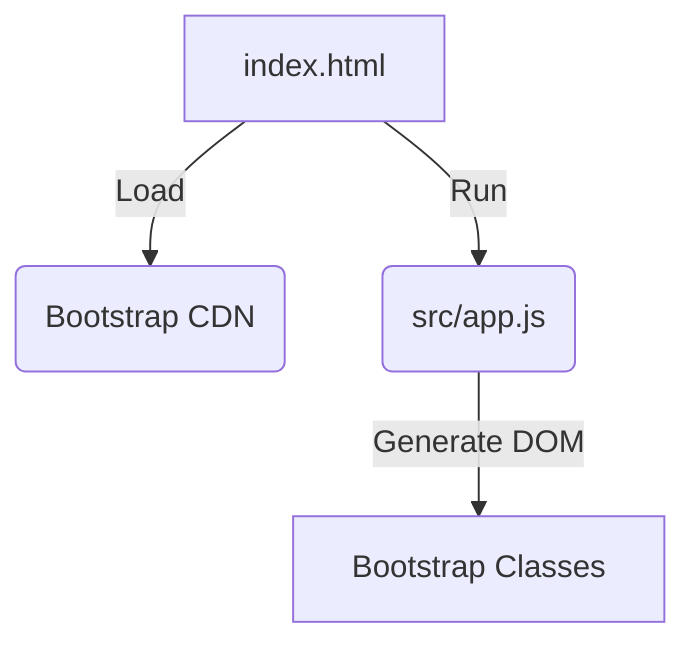

## Context
We are migrating our frontend styling from Tailwind CSS to Bootstrap CSS. This alters the CSS delivery from a utility-first approach to a component-based approach.

## Goals / Non-Goals
**Goals**:
- Swap the CDN link.
- Refactor the class names in `index.html` and `src/app.js` to their Bootstrap 5 equivalents.
- Retain the exact same dark mode and layout appearance using Bootstrap classes.

**Non-Goals**:
- Changing the underlying Javascript logic for tasks.

## Diagram

## Decisions
- **Framework**: Bootstrap 5 CSS via CDN.
  - *Rationale*: Explicitly requested by the user.

## Risks / Trade-offs
- **[Risk] UI differences** -> Bootstrap's dark mode and components don't perfectly match Tailwind defaults. *Mitigation*: We will use Bootstrap's utilities and `data-bs-theme="dark"` attribute to adapt the UI dynamically.
